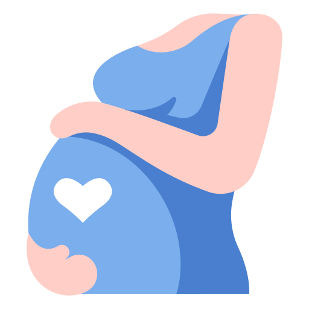

# 💗 Guide de la Femme Enceinte — Pregnancy Guide

A comprehensive, multilingual web application dedicated to the health and well-being of pregnant women. Built by a team of Tunisian healthcare professionals.



---

## 🌐 Live Demo

> Open `index.html` in any modern browser — no server required.

---

## ✨ Features

| Feature | Description |
|---|---|
| 🌍 **3 Languages** | Full French, English & Arabic (RTL) support |
| 🌙 **Dark Mode** | Persistent dark/light theme across all pages |
| 📱 **Fully Responsive** | Mobile, tablet and desktop optimized |
| 👆 **Touch Swipe** | Swipe gestures on all content sliders |
| 📋 **Health Assessment** | AI-powered prenatal health form with analysis |
| 🤖 **Claude AI Analysis** | Personalized medical report via Anthropic API |
| 📊 **Health Statistics** | BMI, weight gain, haemoglobin, blood pressure indicators |
| 🤰 **Posture Guide** | Illustrated prenatal physiotherapy postures |
| 🌬️ **Breathing Guide** | Breathing techniques for pregnancy and labour |
| 💪 **Exercise Guide** | Safe activity recommendations by trimester |

---

## 📁 Project Structure

```
pregnancy-guide/
├── index.html              # Welcome / landing page
├── main.html               # Main guide (4 sections + nav)
├── bilan.html              # 🆕 AI Health Assessment form & results
├── style.css               # Global responsive stylesheet
├── script.js               # Navigation, sliders, translations, dark mode
├── enceinte.png            # Pregnant woman icon (landing page)
├── femme-enceinte.png      # Alternate pregnant woman icon
├── mere.png                # Mother & baby icon (sidebar)
├── Octobre_rose_animations.mp4   # Pink October video (sidebar card)
├── WhatsApp_Image_2026-03-03_at_4_44_48_PM.jpeg   # Suspension posture
├── WhatsApp_Image_2026-03-03_at_4_44_49_PM__1_.jpeg # Squatting posture
├── WhatsApp_Image_2026-03-03_at_4_44_51_PM__1_.jpeg # Left lateral decubitus
├── WhatsApp_Image_2026-03-03_at_4_44_53_PM.jpeg     # All-fours posture
└── README.md
```

---

## 🚀 Getting Started

### Option 1 — Open directly (no server needed)
```bash
# Clone the repository
git clone https://github.com/YOUR_USERNAME/pregnancy-guide.git
cd pregnancy-guide

# Open in browser
open index.html        # macOS
start index.html       # Windows
xdg-open index.html    # Linux
```

### Option 2 — Local dev server (recommended)
```bash
# Using Python
python3 -m http.server 8080

# Using Node.js
npx serve .

# Then visit http://localhost:8080
```

### Option 3 — GitHub Pages
1. Push the repository to GitHub
2. Go to **Settings → Pages**
3. Set source to **main branch / root**
4. Your site will be live at `https://YOUR_USERNAME.github.io/pregnancy-guide/`

---

## 📋 Health Assessment (Bilan Santé)

The `bilan.html` page features a professional prenatal health form with **AI-powered analysis** via the Anthropic Claude API.

### How it works
1. The pregnant woman fills in a comprehensive 5-section form
2. The form collects: general info, obstetric history, current symptoms, lifestyle, medical background
3. On submit, the app calculates key health indicators locally (BMI, weight gain, Hb status, BP, risk level)
4. A detailed prompt is sent to the **Claude Sonnet** model via the Anthropic API
5. The AI returns a structured JSON report with personalized advice
6. Results are displayed with color-coded stat cards, progress indicators, and categorized advice blocks

### API Configuration
The app uses the Anthropic `/v1/messages` endpoint directly from the browser. To set this up:

```javascript
// In bilan.html, the API call is already configured:
const response = await fetch("https://api.anthropic.com/v1/messages", {
    method: "POST",
    headers: { "Content-Type": "application/json" },
    body: JSON.stringify({
        model: "claude-sonnet-4-20250514",
        max_tokens: 1500,
        messages: [{ role: "user", content: prompt }]
    })
});
```

> **Note:** In production, proxy your API requests through a backend to protect your API key. Never expose API keys in client-side code in production environments.

### Health Indicators Calculated
- **BMI** with pregnancy-adjusted categories
- **Trimester** detection from gestational age
- **Weight gain** comparison vs. expected values
- **Haemoglobin** status (normal / mild / severe anaemia)
- **Blood pressure** classification
- **Risk score** based on symptoms, history and lifestyle factors

---

## 🌍 Translation System

All three pages use a unified `data-i18n` attribute system:

```html
<!-- In HTML, mark translatable elements: -->
<h1 data-i18n="header">Guide de la Femme Enceinte</h1>
<input placeholder="" data-i18n-ph="ph_age">
```

```javascript
// In script.js, translations object:
const translations = {
    fr: { header: "💗 Guide de la Femme Enceinte 💗", ... },
    en: { header: "💗 Pregnancy & Maternity Guide 💗", ... },
    ar: { header: "💗 دليل المرأة الحامل 💗", ... }
};

// Apply translations:
function changeLang(lang) {
    document.querySelectorAll('[data-i18n]').forEach(el => {
        el.textContent = translations[lang][el.getAttribute('data-i18n')];
    });
}
```

---

## 🎨 Design System

| Variable | Value | Usage |
|---|---|---|
| `--cr` | `#b0005c` | Primary crimson (headings, accents) |
| `--pk` | `#ff8fb1` | Pink light (buttons, chips) |
| `--pk2` | `#f06292` | Pink medium (gradients) |
| `--glass` | `rgba(255,255,255,0.65)` | Glass morphism cards |
| `--r` | `20px` | Standard border radius |
| `--shadow` | `0 20px 50px rgba(176,0,92,0.12)` | Card shadows |

**Fonts:** Playfair Display (headings) + Poppins (body)

---

## 📱 Browser Support

| Browser | Support |
|---|---|
| Chrome 90+ | ✅ Full |
| Firefox 88+ | ✅ Full |
| Safari 14+ | ✅ Full (incl. iOS) |
| Edge 90+ | ✅ Full |
| Samsung Internet | ✅ Full |

---

## 👥 Team

| Name | Location | Email |
|---|---|---|
| 👩‍⚕️ Rayen Azouzi | Tunis | azaouzirayen21@gmail.com |
| 👩‍⚕️ Oumayma Bel Haj | Sousse | oumaimabelhaj831@gmail.com |
| 👩‍⚕️ Manel Maati | Sfax | manel@gmail.com |
| 👩‍⚕️ Israa Louhichi | Monastir | israa@gmail.com |
| 👩‍⚕️ Mariem Aridhi | Monastir | mariem@gmail.com |

---

## ⚕️ Medical Disclaimer

> This application is for **informational purposes only** and does not constitute medical advice. Always consult a qualified healthcare professional, obstetrician or midwife for diagnosis, treatment and personalized pregnancy care.

---

## 📄 License

© 2026 Guide de la Femme Enceinte. All rights reserved.

---

*Built with ❤️ for mothers everywhere.*
